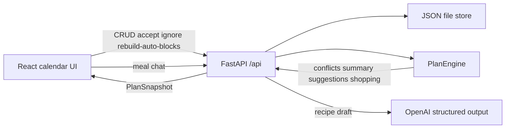

# Planning calendar — technical design

## Product shape

One local user, one calendar. The user edits events; a **deterministic** rule engine recalculates consequences after every mutation. Meal-library chat is the only LLM path: plain text in, structured recipe out.



## Decisions (locked)

| Decision | Choice |
| --- | --- |
| Planner | Deterministic Python `PlanEngine`. No LLM in the planning loop. |
| Meal chat | OpenAI structured output → recipe schema; user confirms before save. Key: `OPENAI_API_KEY` in `backend/.env`. |
| Persistence | Single JSON file under `backend/data/state.json` (in-process load/save). No SQL. |
| Auth | None (single user, local app). |
| Calendar UI | Custom CSS-grid day/week timeline + month grid. Persistent **+** for quick add; overlap opens replace / keep both / cancel. |
| Frontend stack | Vite React-TS + Tailwind v4; proxy `/api` → `:8000`. |
| Routing | `/` calendar, `/recipes` (meal library + chat), `/inventory`, `/rules`, `/shopping`. |
| Time | Store UTC ISO datetimes; `settings.timezone` IANA (default `Europe/Amsterdam`); weeks Monday–Sunday. |

## Domain types (backend Pydantic)

Core entities in `backend/app/schemas/` (and mirrored lightly on the frontend):

- **Event** — `id`, `title`, `type` (`exercise` \| `sporting` \| `meal` \| `shopping` \| `personal` \| `rest`), `start`, `end`, `all_day`, `origin` (`user` \| `auto` \| `suggested`), `conflict`, optional `recurrence` (`daily` \| `weekly` + series id + occurrence overrides), type-specific payload:
  - exercise: `activity`, `completed`
  - meal: `recipe_id`, `portions`, `eaten`
  - shopping reminder: `ingredient_name`
- **Recipe** — ingredients `[{name, quantity, unit}]`, macros, prep time, cuisine, meal type, portion size, storage fields (all meals are vegan; no vegan flag)
- **InventoryItem** — name, quantity, unit, min, replenish, expiration, location
- **Rule** — condition key, scope, action key, priority, strength (`mandatory` \| `advisory`), overridable, enabled, explanation template
- **ShoppingLine** — ingredient, quantity, unit, checked (purchased)
- **Settings** — timezone, weekly exercise goal (default 10h), session min/max (1h30–3h), activity threshold (2h), optional walking cap, protein/carb targets (nullable = inactive)
- **Suggestion** — id, rule_id, explanation, proposed payload (event draft or warning), actions allowed

**PlanSnapshot** (returned after every mutating call and on `GET /api/plan`):

```text
events[], recipes[], inventory[], rules[], shopping[], settings,
week_summary { completed, planned, remaining, sessions_needed, feasible_days, feasible, max_possible },
suggestions[], warnings[]
```

## Backend layout

Replace the current unfinished backend scaffold with:

```text
backend/
├── pyproject.toml          # calendar app deps only (fastapi, uvicorn, pydantic-settings, …)
├── .env.example            # DATA_PATH only (no API keys required)
├── data/state.json         # created on first run
└── app/
    ├── main.py             # CORS + routers only
    ├── config.py           # data_path, timezone default; no api_key
    ├── schemas/            # Event, Recipe, Inventory, Rule, PlanSnapshot, ...
    ├── store/
    │   └── json_store.py   # load/save + in-memory cache
    ├── services/
    │   ├── calendar_service.py
    │   ├── recipe_service.py
    │   ├── inventory_service.py
    │   ├── shopping_service.py
    │   ├── rule_service.py
    │   └── plan_engine.py  # conflicts, exercise math, rules, shopping qty, reminders
    └── router/
        ├── events.py
        ├── recipes.py
        ├── inventory.py
        ├── shopping.py
        ├── rules.py
        ├── suggestions.py
        └── plan.py
```

Drop unused leftover packages and broken service stubs from the scaffold. Keep only what the calendar API needs.

### PlanEngine (single recalculation path)

On every mutation:

1. Expand recurrence into concrete occurrences for the visible/query range (engine always works on concrete intervals for the current week + upcoming).
2. Mark **conflicts**: timed interval overlaps; all-day shopping reminders do not conflict with timed events.
3. Compute **exercise week summary** (completed = marked complete or `end < now`; planned = other exercise on calendar; remaining; free windows; feasibility).
4. Evaluate **enabled rules** in priority order (mandatory beats advisory on ties) → suggestions + warnings; respect dismissals (`ignore` until condition re-true; `suppress` until re-enabled).
5. Sum uneaten meal demand → compare inventory (expired qty unavailable) → **purchase quantity** per assumption 12 → refresh unchecked shopping lines; leave checked lines alone.
6. Walk uneaten meals in time order → upsert/remove **auto** shopping-reminder events.
7. Persist state; return `PlanSnapshot`.

Manual edits set `origin=user`. Rebuild auto blocks (`POST /api/plan/rebuild-auto-blocks`) may replace `origin=auto` only; never moves user events.

### API (all under `/api`)

| Method | Path | Role |
| --- | --- | --- |
| GET | `/health` | liveness (no secrets) |
| GET | `/plan?from=&to=` | full snapshot for range |
| POST | `/plan/rebuild-auto-blocks` | drop auto exercise/routine blocks and refill free time |
| CRUD | `/events`, `/events/{id}` | create/update/delete/duplicate; body can include move/resize fields |
| POST | `/events/{id}/complete` | mark exercise complete / meal eaten |
| CRUD | `/recipes`, `/inventory`, `/rules` | catalog + settings rules |
| GET/PATCH | `/shopping` | list; check line → add qty to inventory |
| POST | `/suggestions/{id}/accept` \| `modify` \| `ignore` \| `suppress` | suggestion actions |
| GET/PATCH | `/settings` | goals and thresholds |

Routes stay thin: validate → service → `PlanEngine` → snapshot.

## Frontend layout (how it looks)

Single composition, not a dashboard of cards. Week view is the home screen.

```text
┌─────────────────────────────────────────────────────────────┐
│  Planner                          Week ▾   Grid  Recipes … │
├────────────────────────────┬────────────────────────────────┤
│                            │  This week                      │
│   Mon … Sun time grid      │  5h30 done · 8h planned         │
│   blocks: origin styles    │  remaining 4h30 · feasible?     │
│   drag / resize / create   │                                 │
│                            │  Suggestions                    │
│                            │  · Cycling 2h — because …       │
│                            │    Accept · Modify · Ignore     │
│                            │                                 │
│                            │  Shopping                       │
│                            │  ☐ Tofu 600 g                   │
└────────────────────────────┴────────────────────────────────┘
```

- **Origin styling**: solid fill = user; hatch/outline = auto; dashed = suggested; red border = conflict.
- **Day / week / month** toggles; default week.
- **Grid** mode: spreadsheet table of events in range (same fields editable).
- Secondary routes: `/recipes` meal library (+ chat add), inventory, rules, shopping.
- `lib/api.ts` + React Query for `PlanSnapshot`; mutations invalidate/refetch plan.
- Feature folders: `features/calendar`, `features/plan-panel`, `features/recipes` (library list + chat add), `features/inventory`, `features/shopping`, `features/rules`.
- Calendar chrome: persistent **+** opens quick-add; on overlap, modal with Replace / Keep both / Cancel before committing.

## Seed data

On empty store, seed: default settings + starter rules from [`requirements.md`](requirements.md) §2 + 2–3 recipes (including tofu rice bowl) + sample inventory so the shopping loop is demoable without empty screens.

## Implementation phases

### Phase 0–4 — MVP (done)

Clean scaffold, calendar + conflicts, exercise planning, meals/inventory/shopping loop, starter rules. See [`README.md`](README.md).

### Phase 5 — Meal library chat + quick-add replace (done)

- Recipes page as meal-library overview with delete.
- `POST /api/recipes/draft` — message → OpenAI structured output → recipe draft.
- Chat UI: one box → draft card → save/discard; `POST /api/recipes` saves.
- Calendar **+** quick-add; overlap modal: Replace / Keep both / Cancel.
- `EventCreate.replace_event_ids` deletes overlaps atomically on create.
- Config: `OPENAI_API_KEY` / `OPENAI_MODEL` in `backend/.env`; meal chat returns 503 if key missing.

## Out of scope (per requirements “Later”)

Rated preferences / preferred times, multi-user, depletion without calendar meals, recurrence beyond daily/weekly, multi-turn meal chat beyond single-message structured draft.

## Docs to write when implementing

- Keep [`requirements.md`](requirements.md) and [`README.md`](README.md) aligned with shipped behavior.
- Optionally add [`docs/architecture.md`](docs/architecture.md) mirroring this design for agents.
- Leave [`docs/context.md`](docs/context.md) alone until a domain-modeling pass (it is currently unrelated Pokémon notes).
